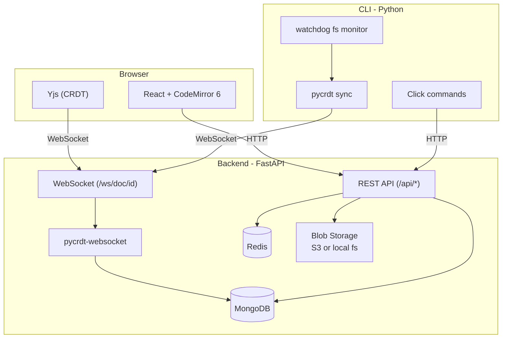

# CollabMark

**Stop re-teaching your AI agent the same rules.**

[](https://pypi.org/project/collabmark/)
[](LICENSE)

Your team's AI agents keep learning the same lessons from scratch. Developer A's Cursor learns that you use Pydantic v2 validators. Developer B's Claude has no idea and makes the same mistakes. A new hire's Copilot starts from zero.

CollabMark fixes this. Write your team's conventions once, and every developer's AI agent reads the latest version automatically.

## The Problem

| Without CollabMark | With CollabMark |
|---|---|
| Developer A teaches Cursor your conventions | Write conventions once in CollabMark |
| Developer B's agent has no idea | Every agent reads the latest version |
| New hire's AI makes solved mistakes | New hire's agent starts fully informed |
| CLAUDE.md gets stale immediately | Changes sync to all agents in seconds |
| Copy-paste across machines | Background CLI keeps everything in sync |

## Get Started in 60 Seconds

```bash
pip install collabmark
collabmark login
collabmark start
```

That's it. Your team's coding standards, architecture decisions, and project context now sync to `.cursor/rules/`, `CLAUDE.md`, and `AGENTS.md` automatically.

## How It Works

1. **Write conventions on the web** -- Your team collaborates on living documents: coding standards, architecture decisions, project context. Real-time editing, version history, inline comments.

2. **CLI syncs to local agent context** -- The `collabmark start` daemon watches for changes and syncs your team's documents to local agent context files. Every AI tool reads them natively.

3. **Every agent stays informed** -- When anyone updates a convention, every team member's Cursor, Claude, and Copilot know about it within seconds.

## Features

- **Team context sync** -- conventions, standards, and decisions synced to every developer's AI agent
- **Works with any AI agent** -- Cursor (.cursor/rules/), Claude (CLAUDE.md), Copilot (AGENTS.md), and more
- **Real-time collaboration** -- live editing with cursor presence, powered by CRDTs (Yjs + pycrdt)
- **CLI sync tool** -- background daemon with bidirectional CRDT sync (`pip install collabmark`)
- **Conflict detection** -- `.conflict` sidecar files when both local and cloud change simultaneously
- **Health diagnostics** -- `collabmark doctor` checks credentials, connectivity, and sync health
- **Offline resilience** -- pending changes queue, empty-content protection, graceful reconnection
- **Full version history** -- every convention change tracked, diffed, and restorable
- **Enterprise auth** -- Google OAuth, SAML 2.0, OIDC, and API keys
- **Folders & sharing** -- organize docs into folders, share with fine-grained permissions
- **Inline comments** -- leave feedback on specific text with threaded replies
- **Beautiful Markdown** -- Mermaid diagrams, syntax-highlighted code, dark mode

## CLI Reference

| Command | Description |
|---------|-------------|
| `collabmark login` | Authenticate via browser (credentials stored in OS keychain) |
| `collabmark start` | Start syncing (foreground or `--daemon`) |
| `collabmark start <link>` | Join a shared folder by link |
| `collabmark start --doc <id>` | Sync a single document by ID or URL |
| `collabmark start -v` | Start with verbose (DEBUG) logging |
| `collabmark status` | Show sync state (global or per-project) |
| `collabmark list` | List all active/stopped syncs across projects |
| `collabmark stop` | Stop sync (interactive, `--all`, or `--path`) |
| `collabmark logs` | View per-project logs (`--all-syncs` for interleaved view) |
| `collabmark conflicts` | List unresolved sync conflict files |
| `collabmark doctor` | Run health checks on your setup |
| `collabmark clean` | Remove stale registry entries |

See [`cli/README.md`](cli/README.md) for the full reference.

## Self-Host / Development Setup

### Prerequisites

- Python 3.12+
- Node.js 20+
- MongoDB 7+ (Docker or Homebrew)
- Google OAuth credentials ([setup guide](#google-oauth-setup))

Optional:

- Redis (for email notifications -- app works without it)
- MinIO/S3 (for file uploads -- falls back to local `backend/media/` directory)
- Docker (simplest way to run MongoDB/Redis)

### Quick Start

```bash
git clone https://github.com/KRHero03/collabmark.git
cd collabmark
make quickstart
```

This will:
1. Copy `.env.example` to `.env` (if missing)
2. Install backend (Python venv) and frontend (yarn) dependencies
3. Start MongoDB and Redis via Docker (if available)
4. Print instructions for starting the dev servers

Then start both servers in separate terminals:

```bash
# Terminal 1 -- Backend
cd backend && source .venv/bin/activate && uvicorn app.main:app --reload

# Terminal 2 -- Frontend
cd frontend && yarn dev
```

App: **http://localhost:5173** | API: **http://localhost:8000** | Swagger: **http://localhost:8000/docs**

### Google OAuth Setup

CollabMark uses Google OAuth for authentication. To set it up:

1. Go to [Google Cloud Console > Credentials](https://console.cloud.google.com/apis/credentials)
2. Create a new project (or select existing)
3. Click **Create Credentials > OAuth 2.0 Client ID**
4. Select **Web application** as the application type
5. Add `http://localhost:8000/api/auth/google/callback` to **Authorized redirect URIs**
6. Copy the **Client ID** and **Client Secret**
7. Paste them into your `.env` file:

```bash
GOOGLE_CLIENT_ID=your-client-id.apps.googleusercontent.com
GOOGLE_CLIENT_SECRET=your-client-secret
```

### Without Docker

If Docker is unavailable, install MongoDB and Redis via Homebrew (macOS):

```bash
brew install mongodb-community redis
brew services start mongodb-community
brew services start redis
```

Or use your OS package manager. Only MongoDB is required; Redis and MinIO are optional.

### Environment Variables

Copy `.env.example` and edit as needed:

```bash
cp .env.example .env
```

| Variable | Required | Default | Description |
|----------|----------|---------|-------------|
| `MONGODB_URL` | Yes | `mongodb://localhost:27017` | MongoDB connection string |
| `MONGODB_DB_NAME` | No | `collabmark` | Database name |
| `GOOGLE_CLIENT_ID` | Yes | -- | Google OAuth client ID |
| `GOOGLE_CLIENT_SECRET` | Yes | -- | Google OAuth client secret |
| `JWT_SECRET_KEY` | Prod | auto-generated in dev | JWT signing secret (32+ chars) |
| `FRONTEND_URL` | No | `http://localhost:5173` | Frontend URL for CORS |
| `REDIS_URL` | No | `redis://localhost:6379` | Redis URL (notifications disabled if unavailable) |
| `S3_ENDPOINT_URL` | No | *(empty = local fs)* | S3/MinIO endpoint. Leave empty for local file storage |
| `NOTIFICATIONS_ENABLED` | No | `true` | Enable email notifications |
| `DEBUG` | No | `false` | Set `true` for dev (relaxes JWT requirement) |

See [`.env.example`](.env.example) for all variables with inline documentation.

### CLI Configuration

The CLI stores all state centrally under `~/.collabmark/`:

```
~/.collabmark/
  credentials.json      # Cached login metadata
  registry.json         # All active/stopped syncs
  projects/
    {folder_id}/
      config.json       # Server URL, folder ID, user info
      sync.json         # Per-file sync hashes and timestamps
      pending.json      # Queued changes from offline periods
```

No `.collabmark/` directories are created inside your project folders.

## Testing

```bash
make test       # Run all tests (backend + frontend + CLI)
make test-be    # Backend only
make test-fe    # Frontend only
make test-cov   # With coverage reports
make ci         # Full pipeline: lint + format + test + build
```

## Architecture



| Layer | Technology |
|-------|-----------|
| Backend | Python 3.12+, FastAPI, Uvicorn, Gunicorn |
| Database | MongoDB 7 (Beanie ODM, Motor async driver) |
| CRDT | pycrdt + pycrdt-websocket (server), Yjs + y-websocket (client) |
| Frontend | React 19, Vite 7, TypeScript 5.9, Tailwind CSS v4 |
| Editor | CodeMirror 6 with yCollab binding |
| Auth | Google OAuth2, SAML 2.0, OIDC, JWT, API keys |
| CLI | Python 3.12+, Click, Rich, httpx, pycrdt, watchdog |
| Blob Storage | S3/MinIO (production) or local filesystem (dev) |
| Deployment | Docker, Railway, GitHub Actions CI/CD |

## Project Structure

```
collabmark/
  backend/
    app/
      auth/       # OAuth, JWT, API key, SSO (SAML/OIDC) auth
      models/     # Beanie document models
      routes/     # REST API endpoints
      services/   # Business logic (document_service, blob_storage, etc.)
      ws/         # WebSocket handler (pycrdt rooms)
    tests/        # Backend tests (pytest + mongomock)
  frontend/
    src/
      components/ # Reusable UI components
      pages/      # Route-level pages
      hooks/      # Custom hooks / Zustand stores
      lib/        # API client, utilities
  cli/
    src/collabmark/
      commands/   # CLI commands (start, stop, status, doctor, conflicts, etc.)
      lib/        # Core logic (sync_engine, config, auth, watcher, crdt_sync)
    tests/        # CLI tests (pytest)
  .cursor/
    skills/       # Reusable agent skills (pre-commit, security, code quality)
  Makefile        # Unified commands (make quickstart, test, ci, etc.)
  Dockerfile      # Multi-stage production build
  docker-compose.yml  # Local dev (MongoDB + Redis + MinIO + Mailpit)
```

## API Key Access

Generate an API key from **Settings** in the web UI. Use it via the `X-API-Key` header:

```bash
curl -H "X-API-Key: cm_your_key_here" http://localhost:8000/api/documents
```

Interactive API documentation at `/api-docs` lets you test all endpoints in the browser.

## Contributing

1. Fork and clone the repository
2. Set up local development (see [Quick Start](#quick-start))
3. Create a feature branch: `git checkout -b your-name/feature-description`
4. Write tests for every function/endpoint you add
5. Ensure the full CI pipeline passes: `make ci`
6. Open a pull request

See `AGENT.md` for detailed coding conventions, architectural decisions, and project progress.

## License

MIT
